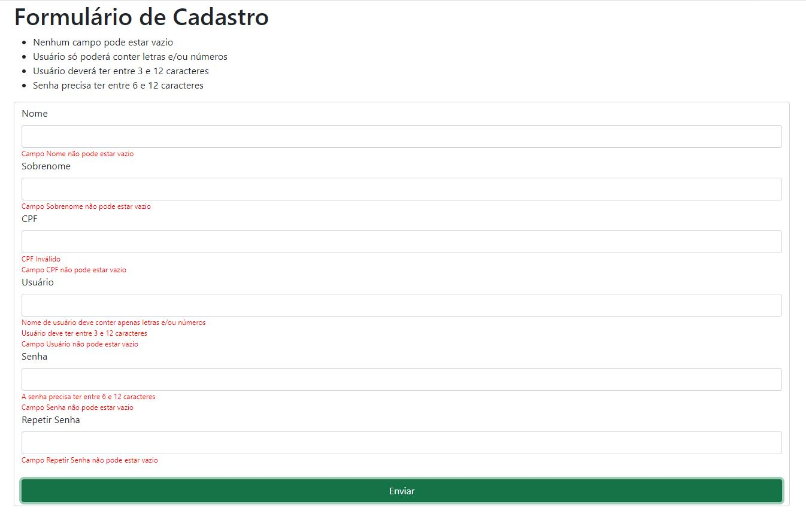

# Validando Campos

Os campos do formulário abaixo foram validados utilizando apenas javascript puro.

Foi criada uma função que valida o CPF baseado na lógica do cálculo para geração e validação de CPF utilizada pela Receita Federal

    

